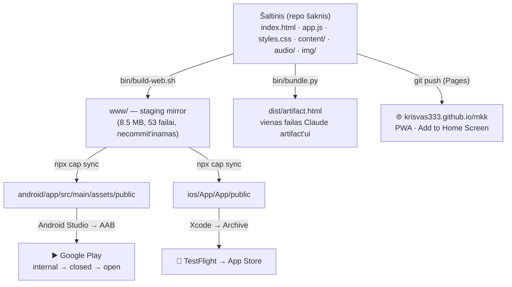
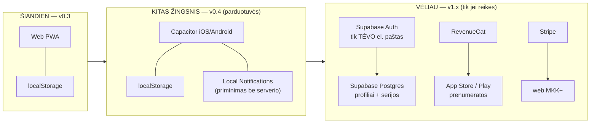

# MKK — architektūra

**Atnaujinta:** 2026-09-15 · **Versija:** v0.3 · **Savininkas:** Kristijonas Vasiliauskas

> **EN summary.** MKK is a static, offline-first PWA (HTML + one JS file + JSON content,
> localStorage only, zero backend, zero tracking). The store path does **not** rewrite it:
> Capacitor wraps the *same* web build as a native iOS/Android shell. Accounts, sync and
> subscriptions are deliberately deferred — Supabase for auth+sync, RevenueCat for store
> subscriptions, Stripe on the web, Capacitor Local Notifications for reminders (no push
> server). Analytics stay **off** because the app targets the kids' category.

---

## 1. Kur esame dabar (v0.3)

```
krisvas333.github.io/mkk/          GitHub Pages, statinis
├── index.html                     kevalas, ~3 KB
├── app.js                         VISA aplikacija, ~76 KB, vanilla JS, be framework'o
├── styles.css                     ~19 KB
├── sw.js                          service worker (network-first turiniui, cache-first paveikslams)
├── manifest.webmanifest           PWA manifestas (standalone, portrait, lt)
├── content/*.json                 VISAS turinys — redaguojamas be kodo
├── audio/mkk-<band>.mp3           7 podcast'ai pagal amžių
├── img/*.webp                     21 iliustracija
└── icons/                         PWA ikonos
```

**Ką tai reiškia praktiškai:**

| Savybė | Būsena | Kodėl taip |
|---|---|---|
| Backend | **Nėra** | Nėra serverio — nėra vaikų duomenų, nėra GDPR duomenų tvarkytojo, nėra sąskaitos |
| Duomenys | `localStorage`, raktas `mkk.v2` | Viskas lieka telefone. Profiliai, serija, tema, kodas |
| Autentifikacija | **Nėra** | Vaikas neregistruojasi. Nėra el. pašto, nėra slaptažodžio |
| Analitika | **Nėra** | 0 `gtag`, 0 `sendBeacon`, 0 trečiųjų šalių skriptų (patikrinta grep'u, žr. TEST-AND-SAFETY.md) |
| Tinklo užklausos | 2: `content/*.json` (savas origin) + Google Fonts | ⚠️ Google Fonts = trečioji šalis, žr. §7 blokatorių |
| Offline | Veikia visas | Service worker precache'ina kevalą + turinį; testas `tests/05-offline-shell.spec.mjs` |
| Kalbos | LT (pagrindinė) + EN | `content/i18n.json`, `LX()` / `t()` app.js viduje |

### Duomenų modelis (`localStorage["mkk.v2"]`)

```jsonc
{
  "profiles": [                     // keli vaikai viename telefone
    { "id": "…", "name": "Testas", "band": "8-9",
      "parent": false,
      "streak": 3, "lastDone": "2026-09-14",
      "days":  { "2026-09-15": { "p": true, "x": true, "c": true, "r": false } },
      "games": { "atsimink": { … } } }
  ],
  "active": "<profile id>",
  "onboarded": true,
  "theme": "light|dark|auto",
  "accent": "raudona",
  "plus":  false,                   // MKK+ atrakinimas
  "code":  "EXO2026",               // būrelio dovanos kodas
  "remind": "18:00"
}
```

**Serijos taisyklė:** diena užsidaro, kai atlikti **3 žingsniai** (`p` podcast · `x` praktika ·
`c` patikrinimas). Skaitymo minutė (`r`) yra 4-as žingsnis ir **sąmoningai neskaičiuojama** —
tai neturi tapti spaudimu. Kodas: `dayDone()` app.js.

**Kas lieka offline visam laikui (ir po parduotuvių):** visas turinys, visi žaidimai, visi
podcast'ai, serija, profiliai. Internetas reikalingas **tik** turinio atnaujinimui.

---

## 2. Kur einame — Capacitor sluoksnis

Capacitor **neperrašo** aplikacijos. Jis paima tą patį statinį web build'ą ir įdeda jį
į native konteinerį (`WKWebView` iOS, `WebView` Android).



**Kodėl `www/`, o ne repo šaknis:** Capacitor atmeta `webDir: "."` (`'.' is not a valid value
for webDir`) — kitaip jis kopijuotų `node_modules/`, `.git/`, `android/`, `ios/` į telefoną.
`bin/build-web.sh` sukuria švarų 8,5 MB veidrodį. **Repo šaknis nepasikeitė** —
`python3 bin/serve.py` ir GitHub Pages veikia lygiai taip pat kaip anksčiau.

| Failas | Paskirtis |
|---|---|
| `capacitor.config.json` | appId `lt.krisvas.mkk` · appName `MKK` · webDir `www` · `server.androidScheme: https` |
| `android/` | pilnas Gradle projektas, atidaromas Android Studio |
| `ios/` | Xcode projektas, priklausomybės per **Swift Package Manager** (Capacitor 8 — CocoaPods nebereikia) |
| `resources/` | `icon.png` 1024² · `splash.png` / `splash-dark.png` 2732² |
| `bin/build-store.sh` | vienas mygtukas: bundle sanity → stage → sync → ką daryti toliau |

**Visų dydžių ikonos/splash'ai generuojami vėliau viena komanda:**

```bash
npm i -D @capacitor/assets
npx @capacitor/assets generate --iconBackgroundColor '#0A0A0A' \
  --iconBackgroundColorDark '#0A0A0A' \
  --splashBackgroundColor '#F7F7F5' --splashBackgroundColorDark '#080808'
```
Jis perskaito `resources/icon.png` + `resources/splash*.png` ir užpildo visus Android
mipmap'us bei iOS `AppIcon.appiconset`.

---

## 3. Target architektūra (kai ateis paskyros)



**Sprendimai, kurie jau priimti:**

- **Push pranešimai:** pradedame nuo `@capacitor/local-notifications` — priminimas 18:00
  suplanuojamas telefone. **Jokio serverio, jokio FCM/APNs rakto, jokio vaiko įrenginio ID.**
  Tikras push (`@capacitor/push-notifications`) — tik jei atsiras priežastis, kurios dabar nėra.
- **Prenumeratos:** parduotuvėse **privaloma** naudoti In-App Purchase — Stripe ten neleidžiamas.
  Todėl RevenueCat (vienas SDK abiem parduotuvėms) **parduotuvėse**, Stripe **tik web'e**.
  Šiandien mokėjimų nėra iš viso: mygtukas `pay` atidaro „Netrukus" langą.
- **Analitika:** **nulis** vaikų kategorijoje. Jei kada nors reikės skaičių — tik savo
  serverio agreguoti skaitikliai be įrenginio identifikatorių, ir tik po tėvų vartų.
- **Autentifikacija:** jei atsiras, prisijungia **tėvas**, ne vaikas, ir tik po tėvų vartų.

### Kas pasikeis, kai atsiras paskyros

| Sluoksnis | Dabar | Su paskyromis | Migracijos rizika |
|---|---|---|---|
| Duomenys | `localStorage` | Supabase + localStorage kaip cache | **Vidutinė** — reikia konflikto sprendimo (serija dviejuose telefonuose) |
| Privatumo politika | „nerenkame nieko" | reikia duomenų tvarkytojo sutarties, DPIA | **Aukšta** — vaikų duomenys ES = griežčiausias režimas |
| Store privacy label | „Data Not Collected" | „Contact Info / Identifiers" | Reikia **naujos** App Review peržiūros |
| Offline | 100 % | 100 % skaitymui, sinchronizacija kai yra ryšys | Žema |
| Kids Category | tinka | **gali nebetikti** jei renkami duomenys | **Aukšta** — čia ir yra priežastis atidėti |

**Rekomendacija:** paskyras atidėti iki po pirmų 100 realių naudotojų. Kol duomenų nėra,
App Review ir GDPR yra lengvi; kai tik atsiranda — abu tampa projektu.

---

## 4. i18n

`content/i18n.json` (builder A) laiko visas eilutes; turinio JSON'uose lauko vertimas gyvena
kaip `{"lt": "...", "en": "..."}`, o `LX(obj, key)` parenka pagal aktyvią kalbą.
**Parduotuvėms:** LT yra pirminė kalba (primary language), EN — antra lokalizacija.
Vienas build'as abiem — kalba nepriklauso nuo binaro.

## 5. Build pipeline

| Komanda | Ką daro | Kada |
|---|---|---|
| `python3 bin/serve.py` | lokalus serveris :8765 su byte-range + utf-8 | kasdien QA |
| `npx playwright test` | 5 e2e testai | prieš kiekvieną push |
| `python3 bin/bundle.py` | `dist/artifact.html` | kai reikia Claude artifact'o |
| `bash bin/build-web.sh` | `www/` veidrodis | automatiškai iš build-store.sh |
| `bash bin/build-store.sh` | sanity → stage → `cap sync` → instrukcijos | prieš kiekvieną store build'ą |
| `git push` | GitHub Pages deploy | kaip ir anksčiau, nepakeista |

## 6. Ko čia NĖRA (ir sąmoningai)

React · bundler · TypeScript · CSS preprocesorius · CI build step · node runtime produkcijoje ·
cookies · third-party SDK · reklamos · chat'as · naudotojų turinys · failų įkėlimas.

**Tai ne skurdumas — tai App Review strategija.** Kiekvienas iš šių dalykų yra atskiras
klausimas peržiūroje ir atskira eilutė privatumo etiketėje.

## 7. Atviri architektūriniai blokatoriai

1. ⚠️ **Google Fonts iš `fonts.googleapis.com`** (`index.html`) — vaikų kategorijoje tai
   trečiosios šalies užklausa su IP adresu. **Būtina self-host'inti šriftus** prieš
   pateikimą (builder A darbas, ~30 min).
2. ⚠️ **Išorinės nuorodos be tėvų vartų** — `target="_blank"` 4 vietose (`app.js` 278, 850,
   885, 1080). Apple Kids Category reikalauja **parental gate** prieš išeinant iš aplikacijos
   (builder A, ~45 min).
3. ⚠️ **Nėra CSP** — rekomendacija §TEST-AND-SAFETY.md.
4. `sw.js` versija `v0.2.0` nesutampa su app v0.3 — bump'inti kartu su turiniu, kitaip
   naudotojai gaus seną cache.
